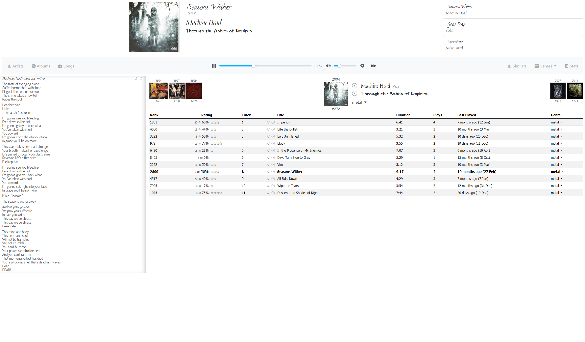
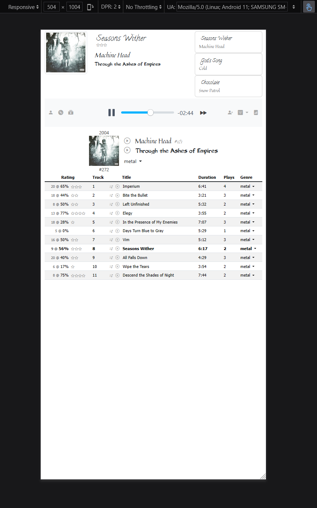
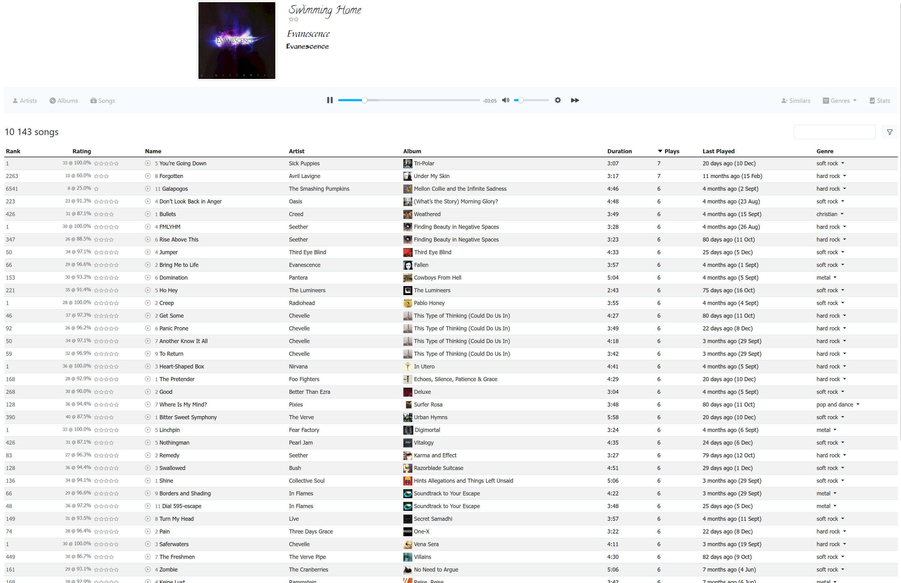
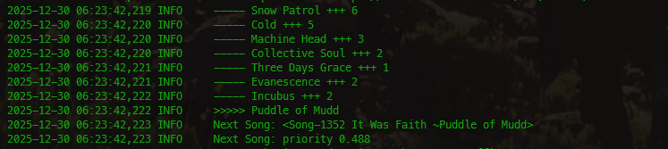
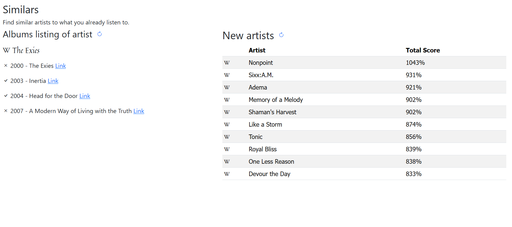

# speler2

music library player




## Why?

Because streaming services sucks.

You should own what you pay for. Paying for a service is a waste of money, like insurance.

This is an album-based player, where the UI is optimized for browsing full albums.


## Features
Nice app-like interface using HTMX.

Automatically fetches lyrics for each song.

If you set it to listen on 0.0.0.0, then you can access it from other devices in your
network, e.g. your phone, since it is optimized for phone screens.



#### Best feature



When playing, there are ratings in the top right corner for the past few songs played. This allows
the songs to be rated. This app does not really support playlists, but you can filter by artist or
genre. This is a continuous player, so it picks the next song based on priority, based on the rating
of the songs and how recently it was played. This way, songs you like are played more often. Also,
it tries to avoid repeating the same artist within an hour. You can see in the log that it waits for
a little time to pass before repeating the same artist (showing how many is still in the queue).




#### Last.fm scrobbler integration

Optionally, you can set the last.fm values in the .env file, and it will scrobble the songs you play
```ini
LASTFM_API_KEY=
LASTFM_SECRET=
```

If you use that, it can also pull recommendations from last.fm:



It also checks wikipedia for artist info if you have missed an album (beta).


## How to use


Just clone the repo and do normal django setup steps. You can use uv to set it up quickly:

```bash
uv sync
```

Copy your .env from .env.dist and set your values, e.g.
```ini
MUSIC_DIR=C:\Users\jacoj\Dropbox\Jaco\Music
```

Extra: in my .PROFILE/.bachrc I have an alias to run the server quickly:

```bash
function speel {
    cd "C:\Users\jacoj\code\speler2"
    .\.venv\Scripts\activate
    python manage.py runserver 0.0.0.0:8888
}
```

## Tech

Django with HTMX. Previous version used React, but that is obsolete thanks to HTMX.

## Contribute

Do whatever you want.
